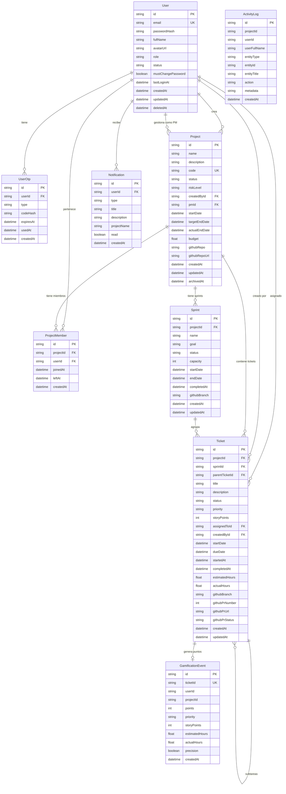

# Diagrama Entidad-Relación — TaskHub

---

## Relaciones clave

| Relación | Tipo | Descripción |
|---|---|---|
| User → Project (createdBy) | 1:N | Un usuario puede crear muchos proyectos |
| User → Project (pm) | 1:N | Un usuario puede ser PM de varios proyectos |
| User ↔ Project | N:M (via ProjectMember) | Membresía con fecha de entrada/salida |
| Project → Sprint | 1:N | Un proyecto tiene múltiples sprints |
| Sprint → Ticket | 1:N | Un sprint contiene múltiples tickets |
| Ticket → Ticket | 1:N (auto) | Subtareas dentro de un ticket |
| Ticket → GamificationEvent | 1:1 | Un ticket completado genera un único evento de puntos |
| User → Notification | 1:N | Un usuario recibe múltiples notificaciones |
| User → UserOtp | 1:N | Un usuario puede tener varios OTPs (uno activo a la vez) |
